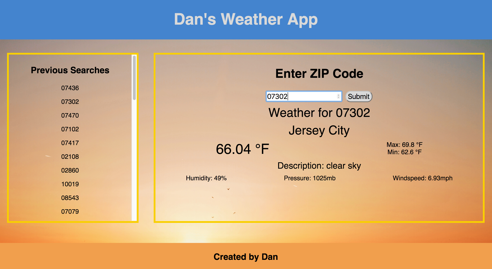

# Dan's Weather App

## About Dan's Weather App

This app contains two main features: (1) on the right-hand side of the screen the user types in a zip code to search for the current weather in the zip code; and (2) on the left-hand side of the screen there is a history of all of the zip codes searched for on this app.

This app is deployed at: http://dan-weather-app.bitballoon.com/

## Technology

This app was created used React. The style/formatting for the app is constructed using CSS flex-box technology. The database of zip codes is maintained on Google Firebase. The app uses axios to post and get data to/from the database.

## Sample Code

Here is the code for the render method used in App.js:

    render() {
      return (
      

        <Header />
        <main>
          

            <Previous className="previous" prevZips={this.state.prevZips} />
          

          

            <h2>Enter ZIP Code</h2>
              <form onSubmit={this.handleSubmit}>
                <label>
                  <input id="form" type="number" value={this.state.value} onChange={this.handleChange} />
                </label>
                <input id="button" type="submit" value="Submit" />
              </form>
            {this.renderWeatherDetails()}
          

        </main>
        <Footer />
      

      )
    };
